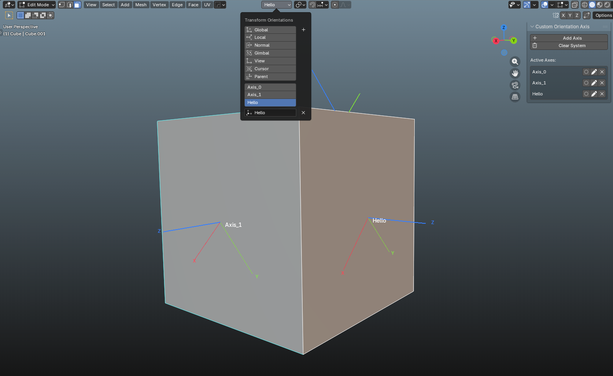

# Custom Orientation Axis

A Blender add-on that creates visible, bone-style XYZ axes on selected faces or edges, making it easy to visualize and manage your custom transform orientations during 3D modeling.

## ✨ Features

* **Visual Axis Display:** Draws clear X (Red), Y (Green), and Z (Blue) orientation lines directly on your mesh, similar to Blender's armature display.
* **Native Sync:** Automatically integrates and syncs with Blender's built-in transform orientation system.
* **Depth Awareness & In-Front Toggle:** Axes naturally hide behind geometry for a clean viewport. You can easily toggle "In-Front" mode to see specific axes through solid meshes.
* **Smart Labelling:** Text labels automatically offset themselves to prevent visual clutter and overlap with Blender's native UI.
* **One-Click Cleanup:** Safely remove all custom axes and purge your orientation list instantly with the "Clear System" button.

  

## 🚀 How to Use

1. Enter **Edit Mode** in the 3D Viewport.
2. Select at least one face or edge that you want to base your orientation on.
3. Open the Sidebar (press `N`) and navigate to the **Custom Orientations** tab.
4. Click **Add Axis** to generate your new orientation.

> **Tip:** Use the Active Axes list in the panel to rename your orientations, toggle their In-Front visibility, or delete them individually.

## 🛠️ Installation

1. Download the repository as a `.zip` file.
2. In Blender (requires version 4.2 or higher), go to `Edit > Preferences > Extensions`.
3. Click the down-arrow icon in the top right corner and select **Install from Disk...**
4. Select the downloaded `.zip` file and enable the add-on.