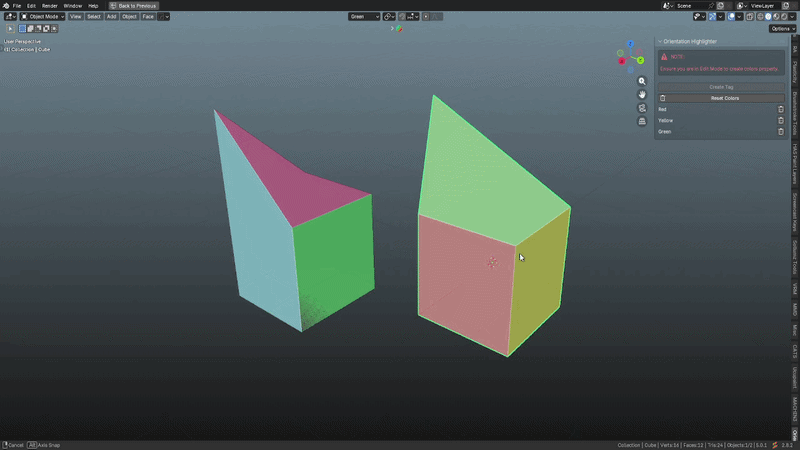

# Custom Orientation Highlighter

Highlights selected faces and edges with custom colors based on their transform orientations to prevent mesh confusion during complex modeling tasks.

  

    

## 🚨 CRITICAL USAGE NOTE

> [!CAUTION]
> ### Ensure you are in Edit Mode to create colors properly.
> To keep custom colors persistent, **hide registered objects instead of deleting them**; recreating objects resets the color index loop.

> [!WARNING]
> **Important Note on Object Deletion:**  
> When you delete registered objects from the scene and create new ones, the color index loop resets. To maintain your custom orientation colors and prevent newly created objects from overriding existing color assignments, hide your registered objects instead of deleting them. This ensures the color database remains consistent.
>
> You can also prevent this error by hiding the first colored object you create, but this isn’t a guaranteed solution; the issue may still occur with other objects.

## 🛠️ Installation

1. Download the repository as a `.zip` file.
2. In Blender, go to `Edit > Preferences > Extensions`.
3. Click the arrow icon in the top right and select **Install from Disk**.
4. Choose the downloaded `.zip` file.